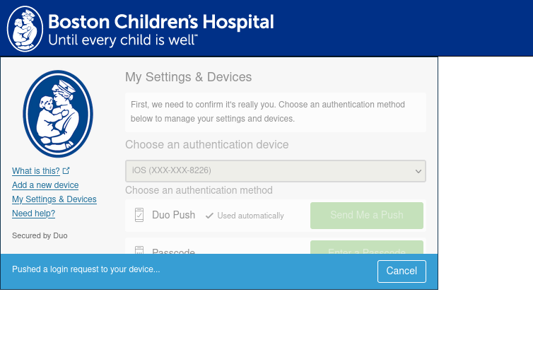
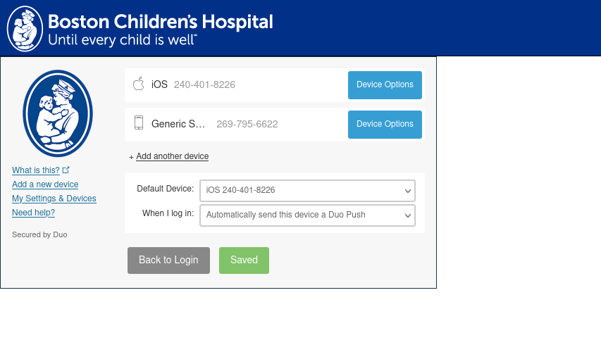

# openconnect-bch

This is a set of scripts for connecting to the Boston Children's Hospital VPN
using open-source, privacy-friendly, CLI-first, and secure software.
More generally, it provides a solution for connecting to a commercial VPN service
called "Pulse Connect Secure" aka "Ivanti" that requires 2-factor authorization
with Duo.

See also: https://gitlab.com/openconnect/openconnect/-/issues/636

## Split-Tunneling

These scripts implement both split-tunneling and optionally split-DNS, which means they will use VPN routes
only when necessary. For example, trying to reach http://web2.tch.harvard.edu will go over the VPN as expected.
However, going to https://wikipedia.org or taking a Zoom call will not go over the VPN connection, which
is better for both privacy and performance.

## How It Works

`bchvpn.js` is a Node.js script which opens `https://vpn.childrens.harvard.edu` in a headless web browser using [Playwright](https://playwright.dev/).
It fills in the HTML form using command-line user input, then proceeds to Duo 2-factor authorization (2FA). After Duo 2FA, the server returns a `DSID`
cookie which can be used by `openconnect`.

## Depencencies

- sudo
- [openconnect](https://gitlab.com/openconnect/openconnect)
- [vpn-slice](https://github.com/dlenski/vpn-slice)
- Node.JS v21.5.0
- [pnpm](https://pnpm.io/)
- Check the [Playwright system requirements](https://playwright.dev/docs/intro#system-requirements)
- (optional, for full DNS) systemd-resolved

On Arch Linux with paru or yay, you can run

```shell
paru -S --needed openconnect vpn-slice pnpm sudo
```

## Installation

```shell
git clone https://github.com/FNNDSC/openconnect-bch.git
cd openconnect-bch

pnpm i
sudo pnpm exec playwright install firefox
```

## Setup

Duo _must_ be configured to automatically send a push notification to your phone. It should look like:



To configure Duo, log into https://vpn.childrens.harvard.edu or log into https://outlook.office365.com for the first time.
Click "My settings & Devices" in the sidebar and select the options as shown:



## Usage

- `node bchvpn.js` will prompt you for your username and password, then you will receive a Duo push notification.
- You can specify username and password as arguments: `node bchvpn.js --username chXXXXXX --password 12345678`. This is insecure.

## DNS

DNS is *partially* handled. The `vpn-slice` component adds entries to `/etc/hosts`. A few important FNNDSC hostnames
and intranet hosts are configured by default. This list can be edited in `bchvpn.js` on line 12. Or, add the
`-a/--append-network` option of `bchvpn.js`. For example,
`node bchvpn.js -a centurion -a chris-next -a chris-next -a chbwiki -a rc-gitlab.chboston.org`

Full DNS functionality with split-DNS is supported with `systemd-resolved`: after a connection is established, run `sudo ./dnsup.sh` to connect to the DNS servers
directly, Otherwise, figure it out on your own.
